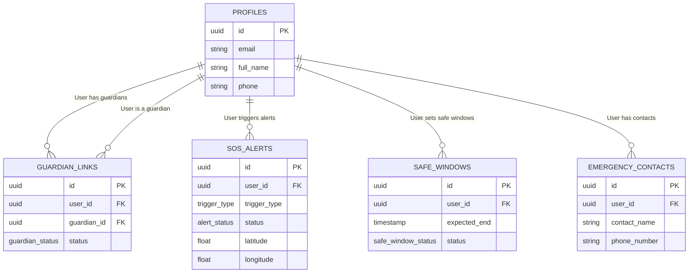

# Database Schema - SafeHer

This document outlines the PostgreSQL database schema for the SafeHer backend, hosted on Supabase.

## Entity Relationship Diagram (Conceptual)

---

## Enumerations (Enums)

- **`trigger_type`**: Defines how an SOS was initiated.
  - `MANUAL_SOS`: User explicitly pressed the SOS button.
  - `SILENT_SOS`: Triggered via a duress action (e.g., fake PIN).
  
- **`alert_status`**: Current state of an SOS alert.
  - `ACTIVE`: Ongoing emergency.
  - `CANCELLED`: Alert was cancelled securely.
  - `SILENT_DURESS_ACTIVE`: Appearing cancelled, but actually escalated in secret.
  - `RESOLVED`: Handled and closed.

- **`guardian_status`**: State of the relationship between user and guardian.
  - `PENDING`: Request sent, awaiting approval.
  - `ACCEPTED`: Linked and active.
  - `REJECTED`: Guardian declined the request.

- **`safe_window_status`**: State of a timed safety monitoring session.
  - `ACTIVE`: Monitoring is currently ongoing.
  - `COMPLETED`: User safely checked in before expiry.
  - `OVERDUE`: Timer expired without a check-in.

---

## Tables

### 1. `profiles`
**Purpose**: Stores extended user information linked to the Supabase Auth system (`auth.users`).

| Column | Data Type | Constraints | Description |
|--------|-----------|-------------|-------------|
| `id` | `UUID` | `PK`, `FK (auth.users.id)` | Primary identifier, matching auth ID. |
| `email` | `VARCHAR(255)` | `UNIQUE`, `NOT NULL` | The user's email address. |
| `full_name` | `VARCHAR(255)` | | The user's display name. |
| `phone_number` | `VARCHAR(20)` | | The user's mobile number. |
| `created_at` | `TIMESTAMPTZ` | `DEFAULT NOW()` | Record creation time. |

**Relationships**: Acts as the central anchor for all other tables. Row-Level Security (RLS) ensures users can only read/update their own profile.

### 2. `guardian_links`
**Purpose**: Manages the linking relationships where one user acts as an emergency guardian for another.

| Column | Data Type | Constraints | Description |
|--------|-----------|-------------|-------------|
| `id` | `UUID` | `PK`, `DEFAULT uuid_generate_v4()` | Unique link identifier. |
| `user_id` | `UUID` | `FK (profiles.id)`, `NOT NULL` | The person being protected. |
| `guardian_id`| `UUID` | `FK (profiles.id)`, `NOT NULL` | The person acting as the guardian. |
| `status` | `guardian_status` | `DEFAULT 'PENDING'` | Current status of the link. |
| `created_at` | `TIMESTAMPTZ` | `DEFAULT NOW()` | When the request was made. |

**Constraints**: `UNIQUE(user_id, guardian_id)` prevents duplicate linking.

### 3. `sos_alerts`
**Purpose**: Records emergency events triggered by the user.

| Column | Data Type | Constraints | Description |
|--------|-----------|-------------|-------------|
| `id` | `UUID` | `PK`, `DEFAULT uuid_generate_v4()` | Unique alert identifier. |
| `user_id` | `UUID` | `FK (profiles.id)`, `NOT NULL` | The user who triggered the alert. |
| `trigger_type`| `trigger_type`| `NOT NULL` | How the alert was generated. |
| `status` | `alert_status`| `DEFAULT 'ACTIVE'` | The current status of the emergency. |
| `visible_message`| `TEXT` | | Optional message attached to the SOS. |
| `latitude` | `FLOAT8` | | Location latitude. |
| `longitude`| `FLOAT8` | | Location longitude. |
| `created_at` | `TIMESTAMPTZ` | `DEFAULT NOW()` | The exact time of the trigger. |
| `cancelled_at`| `TIMESTAMPTZ` | | Time when the alert was cancelled/resolved. |

**Relationships**: Guardians can view `sos_alerts` for users they are linked to (via RLS policies).

### 4. `safe_windows`
**Purpose**: Manages timed sessions (e.g., "Walking home, ETA 20 mins"). If the expected end time passes without a check-in, an alert can be automatically generated.

| Column | Data Type | Constraints | Description |
|--------|-----------|-------------|-------------|
| `id` | `UUID` | `PK`, `DEFAULT uuid_generate_v4()` | Unique session identifier. |
| `user_id` | `UUID` | `FK (profiles.id)`, `NOT NULL` | The user who started the session. |
| `start_time` | `TIMESTAMPTZ` | `DEFAULT NOW()` | When the session began. |
| `expected_end`| `TIMESTAMPTZ` | `NOT NULL` | When the user is expected to check in. |
| `status` | `safe_window_status`| `DEFAULT 'ACTIVE'` | Status of the monitoring session. |

### 5. `emergency_contacts`
**Purpose**: Stores non-guardian contacts who should receive SMS/Email notifications in the event of an SOS (but do not necessarily have an app account).

| Column | Data Type | Constraints | Description |
|--------|-----------|-------------|-------------|
| `id` | `UUID` | `PK`, `DEFAULT uuid_generate_v4()` | Unique contact identifier. |
| `user_id` | `UUID` | `FK (profiles.id)`, `NOT NULL` | The user who owns this contact list. |
| `contact_name`| `VARCHAR(255)` | `NOT NULL` | Name of the contact. |
| `phone_number`| `VARCHAR(20)` | `NOT NULL` | Phone number for SMS notifications. |

---

## How Tables Connect Together

The system is centered around the `profiles` table. When a user requests an SOS alert, a row is created in `sos_alerts` linked via `user_id`. 

For the **Guardian Dashboard**, the backend determines visibility using `guardian_links`. RLS policies on the `sos_alerts` table join against `guardian_links` to ensure that a guardian (logged in via JWT) can query and read only the `sos_alerts` where `user_id` matches a user who has an 'ACCEPTED' (or pending) link to them. This creates a secure, mathematically sound permission layer deep within the PostgreSQL database.
