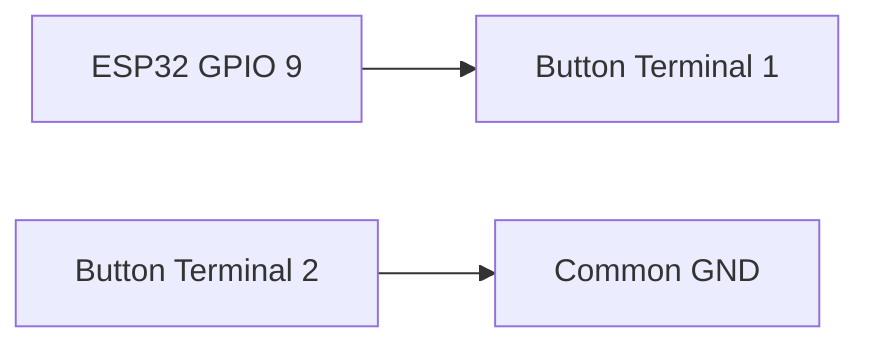

# Button Connection

```mermaid
graph LR
    ESP[ESP32 GPIO 9] --> Button_Pin1[Button Terminal 1]
    Button_Pin2[Button Terminal 2] --> GND[Common GND]
```

*Note: No external pull-up resistor is needed as the firmware initializes the pin with `INPUT_PULLUP`.*
