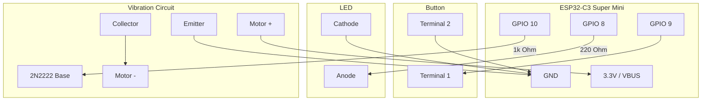

# Complete Ring Wiring

```mermaid
graph TD
    subgraph ESP32-C3 Super Mini
        G8[GPIO 8]
        G9[GPIO 9]
        G10[GPIO 10]
        GND[GND]
        VCC[3.3V / VBUS]
    end

    subgraph Button
        BTN1[Terminal 1]
        BTN2[Terminal 2]
    end

    subgraph LED
        LEDA[Anode]
        LEDC[Cathode]
    end

    subgraph Vibration Circuit
        TR_B[2N2222 Base]
        TR_C[Collector]
        TR_E[Emitter]
        MOT_P[Motor +]
        MOT_N[Motor -]
    end

    %% Button Wiring
    G9 --> BTN1
    BTN2 --> GND

    %% LED Wiring
    G8 -- 220 Ohm --> LEDA
    LEDC --> GND

    %% Vibration Wiring
    G10 -- 1k Ohm --> TR_B
    TR_E --> GND
    TR_C --> MOT_N
    MOT_P --> VCC
```
