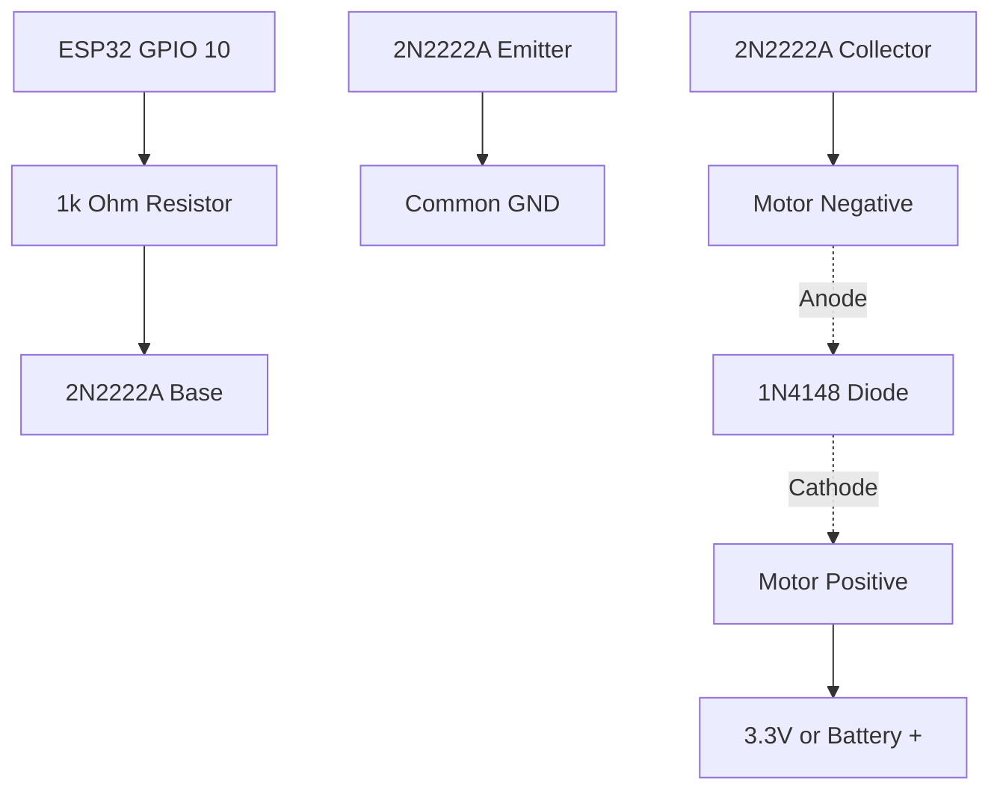

# Vibration Motor Connection

Due to current requirements, the motor is driven via a transistor acting as a switch. A flyback diode protects the circuit from inductive spikes.

```mermaid
graph TD
    ESP[ESP32 GPIO 10] --> Res[1k Ohm Resistor]
    Res --> Base[2N2222A Base]
    Emitter[2N2222A Emitter] --> GND[Common GND]
    Collector[2N2222A Collector] --> Motor_Neg[Motor Negative]
    Motor_Pos[Motor Positive] --> VCC[3.3V or Battery +]
    
    Motor_Neg -.->|Anode| Diode[1N4148 Diode]
    Diode -.->|Cathode| Motor_Pos
```
